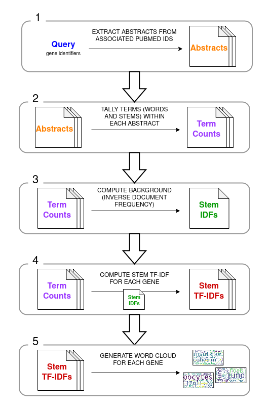
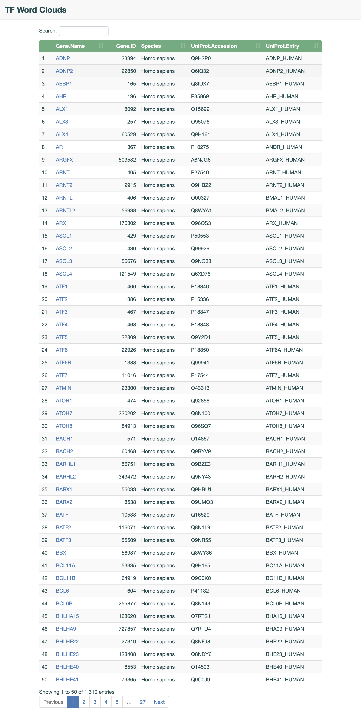
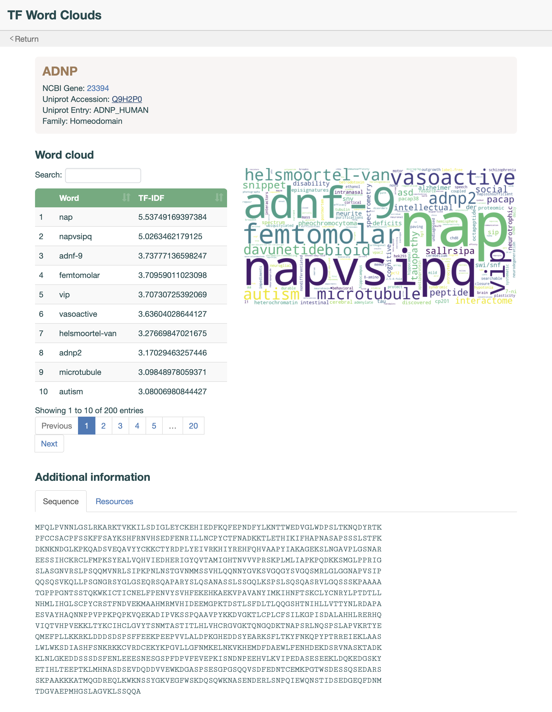
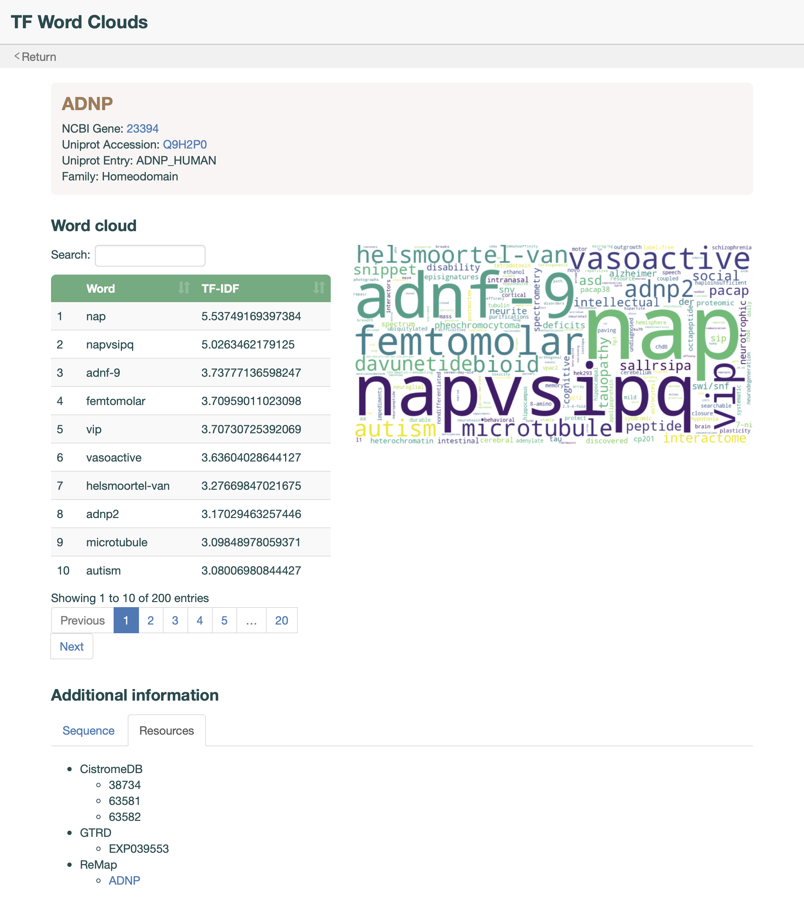

<strong>Gene2WordClouds</strong>
=====
Gene2WordClouds extracts transcription factor(TF)-specific terms from the abstracts of available PubMed literature and creates a wordcloud. Term frequencies computed across the entire set of literature associated with queried TFs served as the background and term frequencies computed from literature associated with an individual TF served as the foreground. The 200 most enriched terms for each individual TF were extracted and displayed in a wordcloud.

Table of Contents
-----
* [Pipeline](#pipeline-overview)
  + [Overview](#scheme)
  + [Scripts](#python-scripts)
* [Dependencies](#dependencies)
  + [Conda](#conda-environment)
* [Usage](#usage)
  + [Application](#application)
  + [Web Interface](#web-interface)
* [Interface](#interface-preview)

Pipeline
-----
#### Scheme


#### Python Scripts
All scripts are located in `utils` directory.
- `uniacc2entrezid.py` - convert Uniprot accession to Entrez gene ID (EntrezIDs).
- `entrezid2pmids.py` - extract all PubMed IDs (PMIDs) associated with query EntrezIDs.
- `gene2pmids_stats.py` - compute statistics regarding PMIDs and EntrezIDs.
- `pmid2abstract.py` - download abstracts of the PMID papers.
- `abstract2words.py` - tally words within each abstract, excluding punctuation and stop words. Stems are obtained for each word.
-  Compute the [Inverse Document Frequency (IDF)](https://en.wikipedia.org/wiki/Tf%E2%80%93idf#Inverse_document_frequency) for each stem.
  - Formula = total number of PMIDs in the analysis over the number of PMIDs containing the specific stem.
- Compute the [Term Frequency-IDF](https://en.wikipedia.org/wiki/Tf%E2%80%93idf#Term_frequency%E2%80%93Inverse_document_frequency) of each stem for each TF.
  - Formula = number of TF-associated PMIDs containing the specific stem multiplied by the IDF of the stem.
- `words2cloud.py` - generate a word cloud for each transcription factor with the top 200 words of unique stems. (Stems are used to remove redundancy in words such as "ctcf" and "ctcf-binding".)


Dependencies
-----
Gene2WordClouds require the following main dependencies.

| Package | Version |
|-|-|
| biopython | 1.78 |
| click | 7.1.2 |
| click-option-group | 0.5.1 |
| distance | 0.1.3 |
| fuzzywuzzy | 0.18.0 |
| matplotlib | 3.3.3 |
| nltk | 3.4.4 |
| nltk_data | 2019.07.04 |
| numpy | 1.22.4 |
| pandas | 1.2.1 |
| python | 3.8.5 |
| scikit-learn | 0.24.1 |
| seaborn | 0.11.1 |
| tqdm | 4.35.0 |
| unipressed | 1.2.0 |
| wordcloud | 1.8.1 |

#### Conda Environment
All packages are provided within the YML environment file. A conda environment named `wordclouds` can be created using the following command.
```bash
conda env create -f ./conda/environment.yml
```

Usage
-----
#### Application
The script `gene2wordclouds.py` starts the Gene2WordClouds application with the following required input options:  
  - `-i` / `--identifier` - Uniprot accession or Entrez gene ID of the gene of interest
    - `--input-file` - list of identifiers provided in a file
  - `-e` / `--email` - email address

Nonmandatory options:
  - `--input-type` - identifier type: [ entrezid | uniacc ] (default: entrezid)
  - `--output-dir` - path to output directory (default: ./)
  - `-p` / `--prefix` - prefix of subdirectory for output (default: md5 digest)
  - `--threads` - number of threads (default: 1)
  - `--zscore` - Z-score filter for PMIDs

Example: `python gene2wordclouds.py --input-file ./dbTF/Homo_sapiens.uniacc.txt --input-type uniacc --email example@ubc.ca --prefix BBA --zscore 2`

#### Web Interface
To run the web interface in your default web browser, go to the Terminal app and run the following command from the root folder of the repository:
```bash
R -e "shiny::runApp('./app/app.R', launch.browser = TRUE)"
```

This will automatically open a new browser window or tab with the URL `http://127.0.0.1:7422`. <br>
To terminate the process simply press `CTRL + C` in the Terminal.

Interface Preview
-----
#### Home Page


#### Gene Page - Panel 1


#### Gene Page - Panel 2

